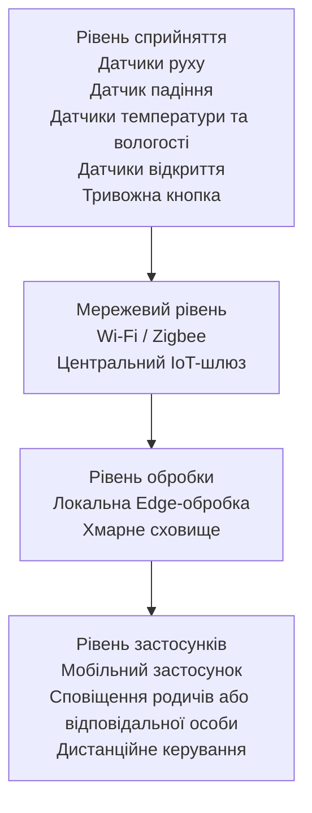

# Практична робота №1
## Вступ до IoT та SMART-технологій

### Варіант 5. Розумний будинок для людини з обмеженою мобільністю

## Мета роботи

Спроєктувати IoT-систему «Розумний будинок», яка підвищує самостійність та безпеку людини з обмеженою мобільністю.

Система повинна автоматизувати керування основними пристроями будинку, контролювати стан приміщення, виявляти небезпечні ситуації та за необхідності сповіщати родичів або відповідальних осіб.

## Основні завдання системи

Для реалізації розумного будинку передбачено такі підсистеми:

1. Підсистема освітлення.
2. Підсистема клімат-контролю.
3. Підсистема безпеки та контролю доступу.
4. Підсистема моніторингу стану мешканця.
5. Підсистема аварійного сповіщення.
## Склад системи

| Пристрій | Що вимірює або робить | Місце розміщення |
|---|---|---|
| Датчики руху | Виявляють присутність та рух людини | Коридор, спальня, вітальня |
| Датчик падіння | Виявляє можливе падіння мешканця | Носимий пристрій на мешканці |
| Датчики температури та вологості | Вимірюють температуру і вологість повітря | Житлові кімнати |
| Розумні лампи | Автоматично вмикають і вимикають освітлення | Кімнати та коридор |
| Розумний термостат | Керує температурою в будинку | Житлова зона |
| Розумний замок | Забезпечує дистанційне відкриття та блокування дверей | Вхідні двері |
| Датчики відкриття | Контролюють стан дверей і вікон | Вхідні двері та вікна |
| Тривожна кнопка | Дозволяє вручну викликати допомогу | Біля ліжка та на носимому пристрої |
| Центральний IoT-шлюз | Збирає дані та виконує локальні сценарії | Усередині будинку |
| Смартфон | Отримує сповіщення та дозволяє дистанційно керувати системою | У мешканця або відповідальної особи |
## Архітектура системи

Архітектура розумного будинку побудована за чотирирівневою моделлю IoT.

### Опис рівнів архітектури

1. **Рівень сприйняття** — датчики збирають інформацію про стан будинку та мешканця.
2. **Мережевий рівень** — забезпечує передачу даних від датчиків до центрального IoT-шлюзу.
3. **Рівень обробки** — виконує локальний аналіз критичних подій та передає необхідні дані до хмари.
4. **Рівень застосунків** — забезпечує сповіщення, моніторинг і дистанційне керування системою через смартфон.
