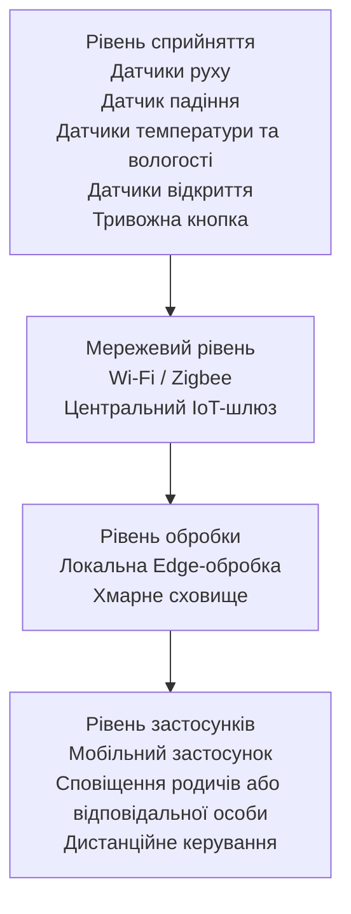

# Практична робота №1
## Вступ до IoT та SMART-технологій

### Варіант 5. Розумний будинок для людини з обмеженою мобільністю

## Мета роботи

Спроєктувати IoT-систему «Розумний будинок», яка підвищує самостійність та безпеку людини з обмеженою мобільністю.

Система повинна автоматизувати керування основними пристроями будинку, контролювати стан приміщення, виявляти небезпечні ситуації та за необхідності сповіщати родичів або відповідальних осіб.

## Основні завдання системи

Для реалізації розумного будинку передбачено такі підсистеми:

1. Підсистема освітлення.
2. Підсистема клімат-контролю.
3. Підсистема безпеки та контролю доступу.
4. Підсистема моніторингу стану мешканця.
5. Підсистема аварійного сповіщення.
## Склад системи

| Пристрій | Що вимірює або робить | Місце розміщення |
|---|---|---|
| Датчики руху | Виявляють присутність та рух людини | Коридор, спальня, вітальня |
| Датчик падіння | Виявляє можливе падіння мешканця | Носимий пристрій на мешканці |
| Датчики температури та вологості | Вимірюють температуру і вологість повітря | Житлові кімнати |
| Розумні лампи | Автоматично вмикають і вимикають освітлення | Кімнати та коридор |
| Розумний термостат | Керує температурою в будинку | Житлова зона |
| Розумний замок | Забезпечує дистанційне відкриття та блокування дверей | Вхідні двері |
| Датчики відкриття | Контролюють стан дверей і вікон | Вхідні двері та вікна |
| Тривожна кнопка | Дозволяє вручну викликати допомогу | Біля ліжка та на носимому пристрої |
| Центральний IoT-шлюз | Збирає дані та виконує локальні сценарії | Усередині будинку |
| Смартфон | Отримує сповіщення та дозволяє дистанційно керувати системою | У мешканця або відповідальної особи |
## Архітектура системи

Архітектура розумного будинку побудована за чотирирівневою моделлю IoT.

### Опис рівнів архітектури

1. **Рівень сприйняття** — датчики збирають інформацію про стан будинку та мешканця.
2. **Мережевий рівень** — забезпечує передачу даних від датчиків до центрального IoT-шлюзу.
3. **Рівень обробки** — виконує локальний аналіз критичних подій та передає необхідні дані до хмари.
4. **Рівень застосунків** — забезпечує сповіщення, моніторинг і дистанційне керування системою через смартфон.

## Сценарії спільної роботи підсистем

### Сценарій 1. Нічне пересування

Коли датчик руху виявляє, що мешканець уночі встав з ліжка, система автоматично вмикає освітлення в спальні та коридорі на комфортному рівні. Після того як рух більше не виявляється, освітлення автоматично вимикається через заданий проміжок часу.

### Сценарій 2. Виявлення падіння

Носимий датчик фіксує різку зміну положення тіла, яка може свідчити про падіння. Система перевіряє наявність подальшого руху. Якщо мешканець не підтверджує, що з ним усе гаразд, IoT-шлюз формує тривожне повідомлення та надсилає його відповідальній особі.

### Сценарій 3. Вихід мешканця з будинку

Після відкриття вхідних дверей система перевіряє датчики руху. Якщо мешканець залишив будинок, система вимикає непотрібне освітлення, переводить клімат-контроль в економний режим та контролює блокування вхідних дверей.

## Виявлення нештатних ситуацій

Система контролює дані датчика падіння та датчиків руху. Нештатною ситуацією вважається:

- виявлення можливого падіння;
- тривала відсутність руху у період, коли мешканець зазвичай активний;
- натискання тривожної кнопки.
## Обробка даних

Для критичних функцій системи використовується **edge-обробка** на центральному IoT-шлюзі безпосередньо в будинку. Це дозволяє системі реагувати на небезпечні ситуації навіть у разі втрати доступу до Інтернету.

Наприклад, інформація про падіння мешканця або натискання тривожної кнопки повинна оброблятися локально із затримкою не більше 1 секунди. Для таких подій очікування відповіді від хмарного сервісу є небажаним.

**Хмарна обробка** використовується для довготривалого зберігання історії подій, перегляду статистики та забезпечення віддаленого доступу відповідальної особи.

Таким чином:

- Edge — критичні події та локальна автоматизація.
- Хмара — зберігання історії, статистика та віддалений доступ.

## Безпечні стани при збоях

Система повинна залишатися максимально безпечною навіть у разі втрати Інтернету, зв'язку між пристроями або електроживлення.

| Ситуація | Безпечний стан системи |
|---|---|
| Відсутній Інтернет | Локальні сценарії продовжують працювати через IoT-шлюз |
| Втрата зв'язку з хмарою | Датчики та автоматизація працюють локально, події тимчасово зберігаються на шлюзі |
| Збій датчика | Система повідомляє про несправність та не використовує недостовірні дані для автоматичних дій |
| Збій розумного освітлення | Зберігається можливість ручного ввімкнення та вимкнення світла |
| Збій розумного замка | Двері можна відкрити звичайним механічним ключем |
| Втрата електроживлення | Критичні пристрої та IoT-шлюз тимчасово працюють від резервного живлення |
| Відновлення живлення | Пристрої повертаються до заздалегідь визначеного безпечного стану |

1. Формує локальне попередження для мешканця.
2. Очікує короткий час на підтвердження, що допомога не потрібна.
3. Якщо підтвердження немає, надсилає повідомлення відповідальній особі.
4. У повідомленні зазначається тип події, час її виникнення та зона будинку, де вона була зафіксована.
5. ## Приватність

Система розумного будинку збирає дані, які можуть розкривати розпорядок дня мешканця. До них належать:

- час появи руху в різних кімнатах;
- час виходу з будинку та повернення;
- інформація про відкриття вхідних дверей;
- дані про падіння та тривалу відсутність руху;
- історія використання освітлення та клімат-контролю.

Для захисту приватності необхідно збирати лише ті дані, які потрібні для роботи системи. Доступ до інформації повинен надаватися лише мешканцю та уповноваженим ним особам. Передача даних між пристроями, хмарою та мобільним застосунком повинна бути захищена шифруванням. Історія подій повинна зберігатися лише протягом необхідного періоду.

## Безпека

| Загроза | Можливі наслідки | Захід протидії |
|---|---|---|
| Несанкціонований доступ до розумного замка | Стороння особа може отримати доступ до будинку | Надійна автентифікація, складні паролі та шифрування з'єднання |
| Перехоплення даних IoT-пристроїв | Розкриття інформації про присутність та розпорядок дня мешканця | Використання зашифрованих каналів передачі даних |
| Компрометація облікового запису мобільного застосунку | Зловмисник може отримати дистанційний доступ до системи | Двофакторна автентифікація та обмеження прав доступу |
| Підміна або передавання хибних даних датчика | Система може виконати неправильну автоматичну дію | Перевірка достовірності даних та контроль стану датчиків |
| Відмова хмарного сервісу або Інтернету | Втрата дистанційного доступу до системи | Критичні сценарії виконуються локально на IoT-шлюзі |
## Джерела

1. NIST. Considerations for Managing Internet of Things (IoT) Cybersecurity and Privacy Risks (NISTIR 8228).  
   https://www.nist.gov/publications/considerations-managing-internet-things-iot-cybersecurity-and-privacy-risks  
   Дата звернення: 05.10.2026.

2. NIST. Internet of Things (IoT).  
   https://www.nist.gov/internet-things-iot  
   Дата звернення: 05.10.2026.

3. Mermaid. Flowcharts — Basic Syntax.  
   https://mermaid.js.org/syntax/flowchart  
   Дата звернення: 05.10.2026.
